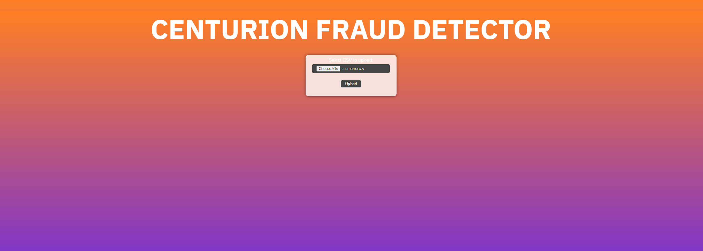

# HackHive - Centurian Fraud Detector
Team: [Siddhant Das](https://github.com/Sid-26), [Sheida Ebrahimi](https://github.com/Sheida-Ebrahimi), [Jayanthan Caithesan](https://github.com/JayCaithesan), [Kieran Mackay](https://github.com/KeiranMacKay), Dennis Martin

## Overview
This web application combines machine learning and Azure services to deliver a fraud detector website. When users input a transaction list, they will be shown which transactions were fraudulent and which were not using our custom-created machine learning module.

## Screenshot

